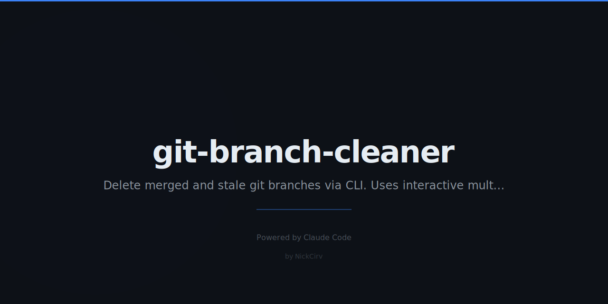

# git-branch-cleaner

Find and safely delete merged, gone, and stale git branches. Interactive multi-select. Zero dependencies.

```
npm install -g git-branch-cleaner
```

---

## Features

- **Merged** — branches fully merged into main/master/develop
- **Gone** — local branches whose remote tracking branch no longer exists
- **Stale** — branches with last commit older than N days (default: 30)
- **Squash-merged** — detects squash merges via commit-tree comparison
- Interactive multi-select with keyboard navigation
- Dry-run mode to preview changes before applying
- Per-branch metadata: last commit date, author, message, age
- JSON output for CI/scripts
- Keep patterns to protect release branches
- Optional remote branch deletion
- Zero npm dependencies — built-in Node.js modules only

---

## Usage

```sh
git-branch-cleaner          # Interactive mode
gbc                         # Short alias

gbc --dry-run               # Preview what would be deleted
gbc --force                 # Delete all candidates without prompting
gbc --remote                # Also delete remote tracking branches
gbc --base develop          # Use develop as the base branch
gbc --stale-days 60         # 60-day stale threshold (default: 30)
gbc --keep "release/*"      # Never delete branches matching pattern
gbc --json                  # Machine-readable JSON output
gbc --help                  # Show help
gbc --version               # Show version
```

---

## Interactive Mode

```
git-branch-cleaner v1.0.0
Base branch: main · Found 4 candidate(s)

Select branches to delete:
  SPACE=toggle, A=all/none, ENTER=confirm, Q=quit

> [x] feature/old-auth-system                    [merged]
       2025-11-12 · 112d ago · Nick · Fix token expiry edge case
  [x] hotfix/tmp-debug-logs                      [gone]
       2025-12-01 · 93d ago · Nick · Add temporary debug logging
  [ ] release/v2.0-prep                          [stale (>30d)]
       2025-10-30 · 124d ago · Nick · Prep release artifacts
  [x] feat/squash-example                        [squash-merged]
       2025-12-20 · 74d ago · Nick · Implement new dashboard
```

**Keys:**
- `SPACE` — toggle selection
- `A` — select / deselect all
- `↑` / `↓` — move cursor
- `ENTER` — confirm and delete selected
- `Q` / `Ctrl+C` — quit without deleting

---

## Detection Details

| Category | Color | How Detected |
|---|---|---|
| Merged | Red | `git branch --merged <base>` |
| Gone | Red | `git branch -vv` with `[gone]` tracking info |
| Stale | Yellow | Last commit timestamp > N days ago |
| Squash-merged | Cyan | `git commit-tree` + `git cherry` comparison |

---

## Safety

These branches are **always protected** and will never be deleted:

- `main`, `master`, `develop`
- `HEAD`
- Current checked-out branch
- Detected base branch
- Any branch matching `--keep` patterns

---

## Examples

```sh
# Preview everything that would be cleaned up
gbc --dry-run

# Delete all stale/merged branches older than 60 days, keep release branches
gbc --force --stale-days 60 --keep "release/*" --keep "hotfix/*"

# Clean up including remote branches, use develop as base
gbc --base develop --remote

# Output as JSON for scripting
gbc --json | jq '.candidates[] | select(.reasons[] == "merged") | .branch'

# Run in CI — force delete merged branches
gbc --force --json > cleanup-report.json
```

---

## JSON Output

```json
{
  "version": "1.0.0",
  "base": "main",
  "current": "feature/my-work",
  "dryRun": false,
  "candidates": [
    {
      "branch": "feature/old-auth",
      "reasons": ["merged"],
      "date": "2025-11-12",
      "author": "Nick",
      "message": "Fix token expiry edge case",
      "daysOld": 112,
      "action": "deleted"
    }
  ],
  "protected": ["main", "feature/my-work"],
  "kept": [],
  "summary": {
    "deleted": 1,
    "wouldDelete": 0,
    "failed": 0
  }
}
```

---

## Security

- Zero external npm dependencies
- Uses `execFileSync` / `spawnSync` only — no shell injection via `exec`/`execSync`
- No network calls except `git fetch --prune` for remote tracking updates
- All sensitive values via `process.env`

---

## Requirements

- Node.js >= 18
- Git installed and accessible in `PATH`

---

## License

MIT
